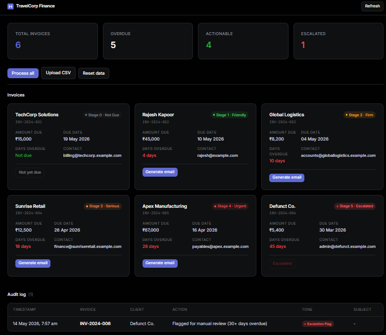
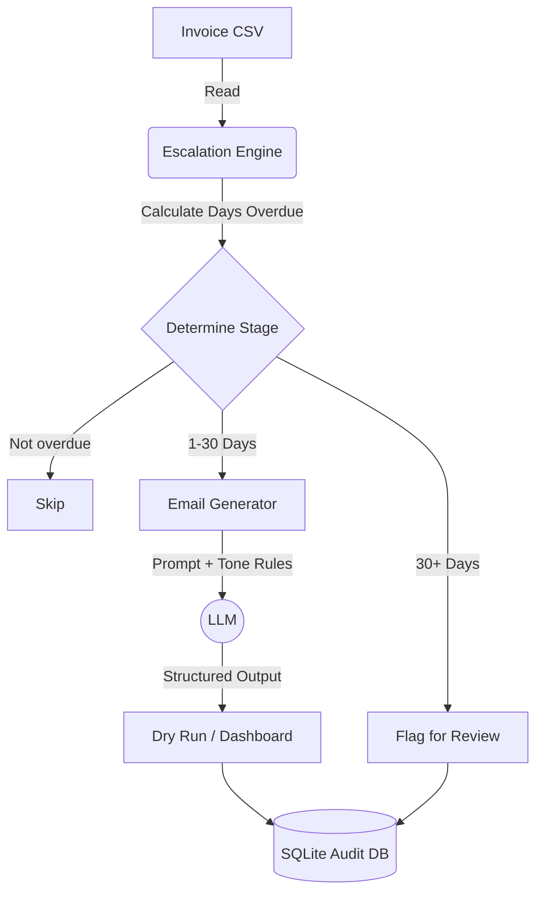

# Credit Follow-Up System | TravelCorp Finance

## Overview
A credit follow-up tool that generates escalation emails for overdue invoices. The system applies a structured tone escalation matrix — starting with friendly reminders and progressing through formal notices — based on how many days each invoice is overdue.



Features:
- **Data Ingestion:** Reads overdue invoices from CSV.
- **Tone Escalation:** Deterministic rules apply Stage 1–4 tone constraints, capping at 30+ days for manual review.
- **Email Generation:** Generates personalised emails using `gpt-4o-mini` with Pydantic structured output.
- **Dry-Run Mode:** Outputs emails to console and dashboard instead of sending.
- **Audit Logging:** Every action is tracked in a local SQLite database (`data/audit.db`).
- **Web Dashboard:** Browser-based interface for reviewing invoices, generating emails, and viewing audit logs.

## Setup

1. **Clone the repository** (or navigate to the directory).
2. **Create a virtual environment:**
   ```bash
   python3 -m venv venv
   source venv/bin/activate
   ```
3. **Install dependencies:**
   ```bash
   pip install -r requirements.txt
   ```
4. **Configure environment:**
   ```bash
   cp .env.example .env
   # Edit .env and add your OPENAI_API_KEY
   ```
5. **Generate sample data:**
   ```bash
   python data/mock_data_generator.py
   ```
6. **Run the server:**
   ```bash
   python server.py
   # Open http://localhost:5000
   ```
   Or run in CLI mode:
   ```bash
   python main.py
   ```

## Architecture



## Audit & Compliance

To maintain a strict trail of all automated actions, every operation is immutably logged into a local SQLite database (`data/audit.db`). 

The audit log captures:
- **Timestamp** of the action.
- **Invoice Number** and **Client Name**.
- **Action Taken** (e.g., "Sent Stage 1 Email", "Flagged for manual review").
- **Tone Used** (e.g., "Warm & Friendly", "Escalation Flag").
- **Email Copy** (The exact subject and body generated by the LLM).

This ensures full transparency for the finance team, allowing operators to review exactly what was sent to a client and why.

## Technical Disclosures

### 1. LLM
- **Model:** `gpt-4o-mini` (OpenAI)
- **Rationale:** Cost-effective, supports function calling for structured output (`with_structured_output`), which guarantees consistent JSON responses with `subject` and `body` fields.

### 2. Framework
- **Framework:** LangChain (`langchain`, `langchain-openai`)
- **Architecture:** Plan-and-execute pattern. The `EscalationEngine` handles deterministic routing (days overdue → stage → tone), then passes structured constraints to the email generator. Structured output via Pydantic ensures response format compliance.

### 3. Prompt Design
- **Structure:** System prompt defines persona, objective, and strict guidelines. Tone instructions are injected dynamically from the deterministic escalation logic.
- **Guardrails:** Pydantic structured output enforces schema compliance. The model must return exactly a `subject` and `body`.

## Security Mitigations

| Risk | Description | Mitigation |
|------|-------------|------------|
| **Prompt Injection** | Malicious input manipulating behaviour | System prompt enforces strict instructions. Structured output (Pydantic) constrains response format. |
| **Data Privacy / PII** | Invoices contain personal info | Prototype runs locally with mock data. Production would mask PII before sending to external APIs. |
| **API Key Exposure** | Keys leaked in code | Managed via `python-dotenv`. `.env` excluded via `.gitignore`. Never hardcoded. |
| **Hallucination** | Incorrect payment details in emails | Structured output + low temperature (0.2). Deterministic details (amount, link) are hardcoded into the prompt. |
| **Unauthorised Access** | Open endpoint | Local CLI/server. Production would require API key/OAuth on all endpoints. |
| **Email Spoofing** | Wrong sender | Dry-run mode. Production requires authenticated SMTP with SPF/DKIM/DMARC. |
